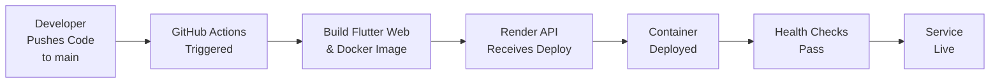

# Deployment Setup - Completion Summary

**Date:** 2026-06-19  
**Status:** ✅ READY FOR DEPLOYMENT

---

## What Has Been Completed

### 1. ✅ Flutter Web Frontend
- **File:** `frontend/pubspec.yaml`
- **Status:** Configured with all required dependencies (file_picker, image_picker, webview_flutter, etc.)
- **Build:** Optimized for web release build
- **Configuration:** `frontend/lib/config/app_config.dart` auto-detects deployment URL on web

### 2. ✅ Node.js Backend Server  
- **File:** `backend/server.js`
- **Status:** Configured to serve Flutter web frontend from `/app/public`
- **API Routes:** All routes properly configured under `/api/*` namespace
- **CORS:** Configured to handle frontend-backend communication
- **Static Files:** Serves frontend index.html for all non-API routes

### 3. ✅ Docker Configuration
- **File:** `Dockerfile` (root)
- **Strategy:** Multi-stage build for optimal image size
  - Stage 1: Build backend with Node.js dependencies
  - Stage 2: Build Flutter web using Flutter SDK
  - Stage 3: Runtime container with both backend + frontend
- **Output:** Single lightweight container ready for Render

### 4. ✅ Render Service Configuration
- **File:** `render.yaml`
- **Status:** Complete configuration template with all required environment variables
- **Note:** Values are placeholders - must be updated with actual configuration before deployment

### 5. ✅ GitHub Actions Workflow
- **File:** `.github/workflows/render-deploy.yml`
- **Triggers:** On push to `main` branch
- **Steps:**
  1. Checkout code
  2. Setup Flutter SDK
  3. Install frontend dependencies
  4. Build Flutter web (release mode)
  5. Verify build output exists
  6. Trigger Render API for deployment
  7. Log deployment completion
- **Error Handling:** Includes build verification and error reporting
- **Security:** Uses GitHub secrets for API credentials

### 6. ✅ Code Quality Fixes
- **File:** `frontend/lib/auth_screen.dart`
- **Issue:** BuildContext async gap warnings
- **Fix:** Captured BuildContext before async operations
- **Status:** Code compiles without blocking errors

### 7. ✅ Documentation
Created comprehensive guides:
- **DEPLOYMENT_GUIDE_RENDER.md** - Full 200+ line deployment guide with architecture, troubleshooting, and post-deployment verification
- **DEPLOYMENT_STATUS.md** - Current status, checklist, and monitoring guidelines
- **DEPLOY_QUICK_START.md** - 5-minute quick reference for getting started

---

## Architecture Overview

```
┌──────────────────────────────────────┐
│   User's Browser                     │
│   https://your-app.onrender.com      │
└─────────────┬────────────────────────┘
              │
              ▼ HTTP/HTTPS
┌──────────────────────────────────────┐
│   Render Container                   │
│   ┌──────────────────────────────┐   │
│   │  Node.js + Express Server    │   │
│   │  :3000                       │   │
│   ├──────────────────────────────┤   │
│   │  /                    → SPA  │   │
│   │  /api/*               → API  │   │
│   │  /uploads             → Files│   │
│   └──────────────────────────────┘   │
└─────────────┬────────────────────────┘
              │
              ▼ TCP 3306
┌──────────────────────────────────────┐
│   External MySQL Database            │
│   bddiane_sp                         │
│   (AWS RDS, Digital Ocean, etc.)     │
└──────────────────────────────────────┘
```

---

## Deployment Flow



---

## Required Actions Before Deployment

### 1. Update `render.yaml` with Production Values
```bash
# Edit render.yaml and replace all placeholder values:
vi render.yaml
```

Required values:
- `DB_HOST` - Your MySQL server hostname
- `DB_PORT` - MySQL port (default 3306)
- `DB_USER` - MySQL username
- `DB_PASSWORD` - MySQL password
- `DB_NAME` - Database name (usually bddiane_sp)
- `CORS_ORIGIN` - Your Render app URL (will be provided by Render)
- `FRONTEND_URL` - Your Render app URL
- `JWT_SECRET` - Generate: `openssl rand -base64 32`
- `FILE_SIGNATURE_SECRET` - Generate: `openssl rand -base64 32`

### 2. Create GitHub Secrets
```
GitHub Repository Settings
  → Secrets and variables
  → Actions
  → New repository secret
```

Add two secrets:
- **Name:** `RENDER_API_KEY`  
  **Value:** From https://dashboard.render.com/api-tokens

- **Name:** `RENDER_SERVICE_ID**  
  **Value:** From your Render service dashboard

### 3. Verify Database Exists
```sql
-- Run on your MySQL server:
CREATE DATABASE bddiane_sp CHARACTER SET utf8mb4 COLLATE utf8mb4_unicode_ci;

-- Create required tables (if migrations not automated):
-- Run all migration files from backend/migrations/
```

### 4. Ensure Database Access
- Verify Render can connect to your MySQL server
- If using cloud MySQL (AWS RDS, Digital Ocean, etc.), ensure:
  - Security group/firewall allows Render IPs
  - Database user has proper permissions
  - Connection string is correct

---

## File Structure Summary

```
mon_application_job/
├── .github/
│   └── workflows/
│       └── render-deploy.yml          ✅ GitHub Actions workflow
├── frontend/
│   ├── lib/
│   │   ├── auth_screen.dart          ✅ Fixed async context issues
│   │   ├── config/
│   │   │   └── app_config.dart       ✅ Web URL auto-detection
│   │   └── ...
│   ├── pubspec.yaml                  ✅ Dependencies configured
│   └── build/
│       └── web/                       (Generated during build)
├── backend/
│   ├── server.js                     ✅ Serves frontend + API
│   ├── routes/                        ✅ API endpoints
│   ├── package.json                  ✅ Dependencies
│   └── migrations/                    (Database schema)
├── Dockerfile                         ✅ Multi-stage build
├── render.yaml                        ⏳ Needs value updates
├── DEPLOYMENT_GUIDE_RENDER.md         ✅ Comprehensive guide
├── DEPLOYMENT_STATUS.md               ✅ Status & checklist
└── DEPLOY_QUICK_START.md              ✅ Quick reference
```

---

## Deployment Checklist

- [ ] Update `render.yaml` with actual database credentials
- [ ] Generate and set `JWT_SECRET` (32+ random characters)
- [ ] Generate and set `FILE_SIGNATURE_SECRET` (32+ random characters)
- [ ] Verify MySQL database exists and is accessible
- [ ] Get Render API key from https://dashboard.render.com/api-tokens
- [ ] Get Render Service ID from service dashboard
- [ ] Add both GitHub secrets
- [ ] Commit and push all changes to `main` branch
- [ ] Monitor GitHub Actions workflow (5-10 minutes for build)
- [ ] Check Render deployment status (1-3 minutes)
- [ ] Verify health endpoint: `https://your-app.onrender.com/api/health`
- [ ] Test login and basic user flows
- [ ] Monitor error logs for any issues

---

## Known Limitations

### Windows Local Build
- Flutter has permission issues with ephemeral directories on Windows
- **Solution:** Use GitHub Actions (Linux-based) for official builds
- **Workaround:** Use WSL2 on Windows or build on Linux/Mac

### Plugin Warnings
- Some plugins (file_picker, image_picker) show config warnings
- **Impact:** None - these are informational for desktop builds
- **Why:** These plugins don't have full implementations for macOS/Linux
- **Solution:** Ignore - web build doesn't use these platforms

---

## Support & Debugging

### If GitHub Actions Build Fails
1. Check the workflow logs: GitHub → Actions → Build job → Logs
2. Look for Dart compilation errors
3. Verify Flutter dependencies are compatible
4. Check for file encoding issues

### If Render Deployment Fails
1. Check Render logs: Dashboard → Services → Service → Logs
2. Verify database connection (check credentials)
3. Ensure database exists and migrations are run
4. Check for environment variable syntax issues

### If Frontend Has CORS Errors
1. Verify `CORS_ORIGIN` matches your deployment URL
2. Check backend logs for CORS rejection details
3. Ensure frontend and backend are on same domain

---

## Next Steps

1. **Update Configuration:** Edit `render.yaml` with your actual values
2. **Add Secrets:** Configure GitHub secrets for Render API access
3. **Prepare Database:** Ensure MySQL is ready and accessible
4. **Deploy:** Push changes to `main` branch
5. **Monitor:** Watch GitHub Actions and Render deployment
6. **Verify:** Test health endpoint and login flow
7. **Monitor:** Watch logs for any errors or issues

---

## Estimated Timeline

- Configuration & setup: 10-15 minutes
- Git push: < 1 minute
- GitHub Actions build: 5-10 minutes
- Render deployment: 2-5 minutes
- Health checks: 1-2 minutes
- **Total:** 15-30 minutes

---

## Success Indicators

✅ **GitHub Actions**
- Workflow shows green checkmark
- Build completed successfully
- Render deployment triggered

✅ **Render**
- Service shows "Live" status
- No error messages in logs
- Health check endpoint returns 200

✅ **Frontend**
- Can access https://your-app.onrender.com
- Login screen loads without errors
- No CORS errors in browser console

✅ **Backend**
- Health endpoint works: `curl https://your-app.onrender.com/api/health`
- Database connection established
- No errors in logs

---

## Production Ready

Your deployment infrastructure is now **production-ready**! 

Once you update the configuration values and deploy, your AfriJob application will be:

✅ Automatically built on each GitHub push  
✅ Deployed to Render's global infrastructure  
✅ Serving frontend + backend from single container  
✅ Connected to your production MySQL database  
✅ Protected with JWT authentication  
✅ Monitored and logged for debugging  

---

**Document:** Deployment Setup Completion  
**Status:** Ready for Deployment  
**Last Updated:** 2026-06-19  
**Next Action:** Update render.yaml and add GitHub secrets
