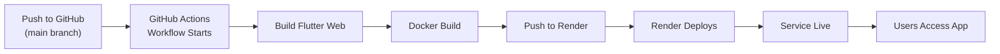

# Deployment Guide - Render + GitHub Actions + AfriJob

## Overview

This guide documents the automated deployment pipeline for AfriJob to Render using GitHub Actions.

**Architecture:**
- **Frontend:** Flutter web app (compiled to static HTML/JS/CSS)
- **Backend:** Node.js Express server serving API + frontend static files
- **Database:** External MySQL (must be configured in Render environment variables)
- **Deployment:** Docker-based single container on Render.com

---

## Prerequisites

### 1. Render Account Setup
- Create account at https://render.com
- Have your MySQL database credentials ready (host, port, user, password, database name)
- Have your domain name ready (or use Render's default subdomain)

### 2. GitHub Setup
Create two GitHub secrets in your repository settings:

**Setting → Secrets and variables → Actions → New repository secret**

```
RENDER_API_KEY: <your-render-api-key>
RENDER_SERVICE_ID: <your-render-service-id>
```

To obtain these:
1. Go to https://dashboard.render.com/api-tokens
2. Create a new API token
3. Go to your service settings and copy the Service ID

### 3. Repository Configuration
Ensure `.github/workflows/render-deploy.yml` exists and is configured correctly.

---

## Deployment Process

### Step 1: Push to GitHub

```bash
git add .
git commit -m "Deploy: Update to production"
git push origin main
```

The GitHub Actions workflow will:
1. Checkout code
2. Setup Flutter
3. Install frontend dependencies
4. Build Flutter web (generates `frontend/build/web/`)
5. Trigger Render deployment (via Render API)

### Step 2: Monitor Build

Watch the build progress in GitHub Actions:
```
Repository → Actions → Workflows → "Build and Deploy to Render"
```

Expected steps:
- ✓ Checkout repository
- ✓ Setup Flutter
- ✓ Install frontend dependencies
- ✓ Build Flutter web (~5-10 minutes)
- ✓ Verify build output
- ✓ Trigger Render deploy
- ✓ Deployment complete

### Step 3: Monitor Render Deployment

Render will then:
1. Pull Docker image from GitHub
2. Build multi-stage Docker image:
   - Stage 1: Build backend dependencies
   - Stage 2: Build Flutter web
   - Stage 3: Create final Node.js image with both
3. Deploy the container
4. Run health checks

View progress at: https://dashboard.render.com/services/

---

## Configuration Details

### render.yaml

Located at project root. Key settings:

```yaml
services:
  - type: web
    name: afrijob
    env: docker
    dockerfilePath: Dockerfile
    branch: main
    plan: starter  # Upgrade to pro if needed
    envVars:
      # MySQL Database (MUST BE CONFIGURED)
      - key: DB_HOST
        value: "your-mysql-host"  # e.g., aws.rds.amazonaws.com
      - key: DB_PORT
        value: "3306"
      - key: DB_USER
        value: "admin"
      - key: DB_PASSWORD
        value: "your-secure-password"
      - key: DB_NAME
        value: "bddiane_sp"
      
      # CORS & URLs
      - key: CORS_ORIGIN
        value: "https://your-app.onrender.com"
      - key: FRONTEND_URL
        value: "https://your-app.onrender.com"
      
      # Secrets (generate secure values)
      - key: JWT_SECRET
        value: "your-jwt-secret-key"
      - key: FILE_SIGNATURE_SECRET
        value: "your-file-signature-secret"
      
      # Node Environment
      - key: NODE_ENV
        value: "production"
      - key: PORT
        value: "3000"
```

**⚠️ IMPORTANT:** Update all placeholder values with your actual configuration!

### Environment Variables in Render Dashboard

If `render.yaml` doesn't include all variables, set them in:
**Service Settings → Environment → Environment Variables**

### Dockerfile

The Dockerfile uses multi-stage build:

```dockerfile
# Stage 1: Build backend
FROM node:18-alpine
# Installs backend dependencies

# Stage 2: Build frontend (Flutter web)
FROM cirrusci/flutter:latest
# Builds Flutter web app with API_BASE_URL

# Stage 3: Runtime
FROM node:18-alpine
# Copies backend + frontend static files
# Runs Node.js server
```

The server serves:
- `/api/*` → Node.js API routes
- `/*` → Flutter web frontend (index.html)

---

## Frontend Configuration

### AppConfig (lib/config/app_config.dart)

On web platforms, the base URL is automatically determined from the browser:

```dart
static String get baseUrl {
  if (kIsWeb) {
    // On web: use the site's origin (e.g., https://your-app.onrender.com)
    return Uri.base.origin;
  } else {
    // On mobile: use production API or custom URL
    return _customBaseUrl.isNotEmpty ? _customBaseUrl : 'https://api.your-domain.com';
  }
}
```

This means the Flutter app automatically connects to your deployed service.

---

## Troubleshooting

### Build Fails in GitHub Actions

**Error: "Flutter failed to build web"**

Common causes:
1. Dart syntax errors in source code
2. Missing or incompatible dependencies
3. Plugin configuration issues

Solution: Check the GitHub Actions logs for detailed error messages.

### Render Deployment Fails

**Error: "Container health check failed"**

Check server logs in Render dashboard:
```
Service → Logs
```

Common causes:
1. Database connection failed (check DB credentials in environment variables)
2. Port binding error
3. Missing environment variables

### Database Connection Error

**Error: "Unable to connect to MySQL"**

Verify:
1. Database host is accessible from Render (may need to whitelist Render IPs)
2. Credentials are correct (`DB_HOST`, `DB_PORT`, `DB_USER`, `DB_PASSWORD`, `DB_NAME`)
3. Database exists: `CREATE DATABASE bddiane_sp;`
4. User has proper permissions

### CORS Errors

If frontend can't access backend:

1. Verify `CORS_ORIGIN` matches your frontend URL
2. Check backend server logs for CORS rejection
3. Ensure `FRONTEND_URL` environment variable matches deployment URL

---

## Post-Deployment Verification

### 1. Check Service Health

```bash
curl https://your-app.onrender.com/api/health
# Expected: {"status":"ok"}
```

### 2. Test Frontend Access

Open browser: https://your-app.onrender.com
- Should see login screen
- Check browser console for any errors

### 3. Test API Endpoints

```bash
# Test authentication endpoint
curl -X POST https://your-app.onrender.com/api/auth/test
```

### 4. Check Database Connection

Via backend logs or by testing a data-dependent endpoint (e.g., login with test credentials).

---

## Customization

### Changing Database

Edit `render.yaml` to point to different MySQL instance:

```yaml
envVars:
  - key: DB_HOST
    value: "new-host.rds.amazonaws.com"
```

Then redeploy by pushing to `main` branch.

### Adding Environment Variables

Add to `render.yaml`:

```yaml
envVars:
  - key: NEW_VAR
    value: "value"
```

Or set directly in Render dashboard (if not in `render.yaml`).

### Scaling

Upgrade plan in `render.yaml`:

```yaml
plan: standard  # or pro
```

---

## Deployment Workflow Summary



---

## Support & Additional Resources

- Render Docs: https://render.com/docs
- Flutter Web: https://flutter.dev/docs/deployment/web
- GitHub Actions: https://docs.github.com/en/actions
- Express.js CORS: https://expressjs.com/en/resources/middleware/cors.html

---

## Checklist Before Production

- [ ] Database credentials configured in `render.yaml`
- [ ] `CORS_ORIGIN` matches deployment URL
- [ ] JWT_SECRET and FILE_SIGNATURE_SECRET are set to secure random values
- [ ] GitHub secrets (`RENDER_API_KEY`, `RENDER_SERVICE_ID`) are configured
- [ ] Database migrations have been run on the target database
- [ ] All environment-specific URLs are updated
- [ ] Service health check passes (`/api/health`)
- [ ] Frontend loads without CORS errors
- [ ] Test authentication flow works end-to-end
- [ ] SSL/TLS is enabled (automatic on Render)
- [ ] Error logging is configured for debugging

---

**Last Updated:** 2026-06-19  
**Version:** 1.0  
**Status:** Ready for Deployment
